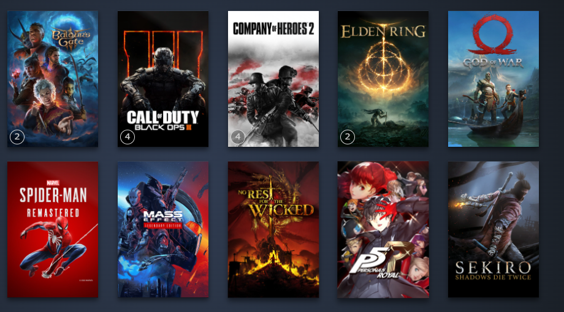
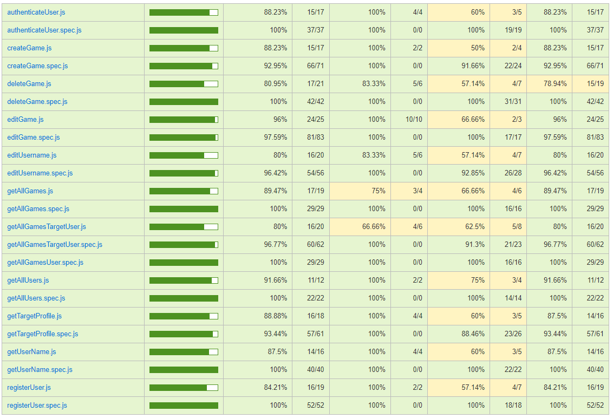

# Gamehub

GameHub is an application designed for video game players. It allows you to create a custom list of your favorite games, where you can rate each title. Additionally, it has a section displaying the lists of all players. Each player will have their own profile.

We will gradually implement more features into the app.

## Functional

### Use Cases

User
- register user
- log in
- implement game in your gameList
- edit the games
- delete the games
- view the game list
- edit the game list
- view others profiles
- view others game lists

### UI Design

[Figma](https://www.figma.com/design/GAs2cGmy06ZUkws4R8jZnI/Proyecto-Final?node-id=0-1&t=lpvyYDHEdKy8XEwY-1)

## Technical

### Data Model

#### User

- id (auto)                    identificador 
- name (string, required)      nombre de usuario
- username (string, required)  nombre de usuario unico
- email (string, required)     direccion de correo electronico
- password(string, required)   contraseña del usuario
- profilePicture (string)      image de perfil del usuario
- gameList (game.id)           id de cada juego

#### Game

- id (auto)                              identificador 
- author (user.id)                       id del usuario         
- titleVideoGame (string, required)      titulo del videojuego
- imageGame (string, required)           image del videojuego
- rating (number, required)              nota asignada al videojuego por el usuario
- hoursInTheGame (number, required)      cantidad de horas que el usuario ha jugado

## Technologies Used

- Frontend: React, Vite
- Backend: Node.js
- Testing: Mocha Chai

### Code Coverage

