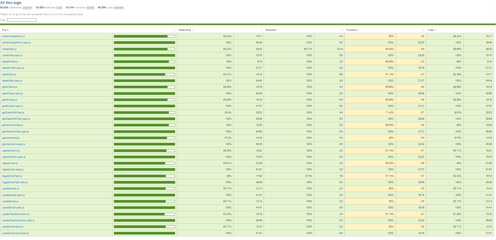

# Family Sync

An application to share tasks, calendar, shopping list and more, between members of the application.

## Functional

### Use Cases

Admin

- set avatar
- create user
- edit user
- delete user
- edit task
- delete task

Admin | User
 
- view timed tasks(calendar)
- create task
- mark task
- view tasks

#### version 0.1
Admin 

- delete item from shopping list

Admin | User

- add item to shopping list
- view shopping list

### UI Design

[Figma](https://www.figma.com/proto/5XWU1EnIKyi18M46iJRd96/Project?page-id=0%3A1&node-id=11-74&viewport=785%2C384%2C0.5&t=PaSZ4ZOTndgOqpHe-1&scaling=scale-down&content-scaling=fixed&starting-point-node-id=11%3A74)

## Technical

### Blocks

- App
- Api
- DB

### Modules

- app
- api
- com
- doc

### Data Model

User

- id (auto)
- name (string, required)
- username (string, required)
- email (string, unique)
- password (string, required, hashed)
- avatar (string)
- role(string, enum: admin | user)
- family(string)

Task

- id (auto)
- title(string, required)
- done(boolean, default false)
- date(Date)
- family(string)
- assignee(User.id)

Code coverage

