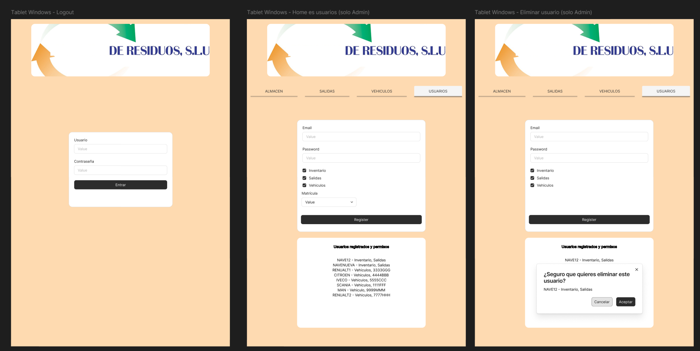

# DEMO - CDR

Las aplicaciones personalizadas son herramientas diseñadas específicamente para satisfacer las necesidades particulares de una empresa. Estas aplicaciones pueden ofrecer una amplia gama de beneficios que pueden mejorar la eficiencia, la productividad y la competitividad. Algunas de las principales razones por las que son útiles: Adaptación a NECESIDADES Específicas, INTEGRACION con Sistemas Existentes, Mejora de la EFICIENCIA Operativa, SEGURIDAD y Recopilación y Análisis de Datos.

### Registro y lista de Usuarios

### Casos de Usuario

### Administador

- Crear usuario (nombre, contraseña y asignar sección)
- Eliminar usuario
- Acceso y uso de todas las secciones

### Usuario

- Acceso y uso de la seccion asignada

### Almacen e Inventario

El inventario sera un registro detallado de los residuos que la empresa almacena, y es fundamental para la gestión eficiente de los recursos. 

Aquí tienes algunas razones clave por las cuales es necesario mantener un inventario: control real de existencias, optimizar recursos, evitar accidentes y ayudar en la planificacion y toma de decisiones.

## Almacen

Solo podra acceder el usuario que tenga asignada esta seccion (almacen:inventario, estancados, datos y buscar)

## Inventario

El usuario podra hacer registro de los residuos:

    - LER: Desplegable y filtro de listado Europeo de Residuos.
    - Acondicionamiento o almacenado en: GRG, Palet, Big Bag, Bidones de 200 o de inferior tamaño.
    - Peso: indicado en kilogramos.
    - Estancado: marcar cuando el residuo se encuentra almacenado (minimo un mes) durante un periodo prolongado.

En el inventario el usuario podra ver los residuos registrados donde se mostraran agrupados por LER y diferenciados por su acondicionamiento e indicando su peso en kg.

## Estancados

Usuario pueden consultar cuales son los residuos se encuentra almacenados (minimo un mes) durante un periodo prolongado.

## Datos

- Trabajores pueden consultar resumen de los datos registrados en inventario:
    - Grafica horizontal
    - Cantidad total en kg por LER (residuo)

## Buscar

El usuario puede buscar todos los residuos registrados con un LER especifico:
    - Introducir un LER en el buscador
    - Eliminar un registro insertado

### Salidas y Cargas de Trailer

Preparar una lista de la carga de un camión es fundamental por varias razones, tanto logísticas como de seguridad y eficiencia operativa. algunas de las razones más importantes: optimizar espacio, seguridad o evitar accidentes, seguimiento o trazabilidad y ayudar en la planificacion y toma de decisiones.

## Salidas

Solo podra acceder el usuario que tenga asignada esta seccion (salidas:trailer1, trailer2, trailer3 y buscar)

## Trailer 1,2 y 3

El usuario podra hacer un registro de los residuos que se cargaran en el trailer, podra indicar:

    - LER: Desplegable y filtro de listado Europeo de Residuos.
    - Acondicionamiento del residuo: GRG, Palet, Big Bag, Bidones de 200 o de inferior tamaño.
    - Peso: indicado en kilogramos.

## Buscar

El usuario puede buscar todos los residuos registrados para cargar en los trailers con un LER especifico:
    - Introducir un LER en el buscador
    - Eliminar un registro insertado
    - Se mostrara diferenciado por TRAILER1-3

### Vehiculo y Mantenimiento

Hacer un seguimiento del estado de los vehículos es crucial por varias razones que abarcan la seguridad, el rendimiento operativo, la economía y el cumplimiento normativo. Algunas de las razones que justifican hacerlo: seguridad de todos, optiminar uso y evitar inactividad, económica, cumplir las leyes, por el medio ambiente y ayudar en la planificacion y toma de decisiones.

## Vehiculos

Solo podra acceder el usuario que tenga asignada de esta seccion, un vehiculo especifico (furgo1, furgo2, camion1, camion2, camion3,camion4 y buscar)

## Furgo1 (ejemplo)

El usuario podra hacer un seguimiento o revision del estado del vehiculo asignado, mediante un checklist o un formulario.

Partes que hay que vigilar o revisar:
    - Documentacion
    - Luces
    - Motor
    - Freno
    - Neumaticos
    - Transmision
    - Zona del conductor
    - Zona de la carga
    - Carroceria
    - Accesorios basicos
    - Accesorios ADR

