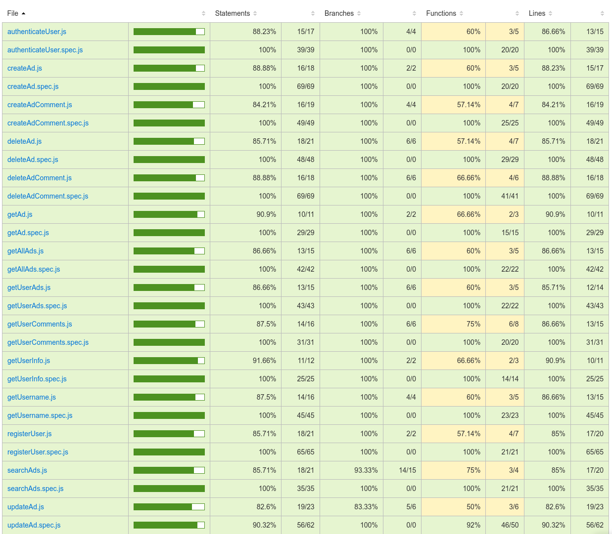

# Farm-Hub

An awesome app for putting in contact sellers & buyers of farming products mostly in rural areas. Platform developed with React with the main objective of putting in touch sellers and buyers of farm products. The app allows user to search products withing a 50km radious.


## Usage

Once the server and frontend are running, you can access the application at http://localhost:8080. Here, you can:

-   Create Ads: Post new product ads with detailed information.
-   Manage Ads: Edit and update your existing ads.
-   Delete Ads: Remove ads you no longer wish to display.
-   Search for Products: Search for products by name and within a 50km radius.
-   View Nearby Ads: See product ads within a 50km radius of your location.
-   Add Comments: Engage with product ads by adding comments.
-   Manage Comments: Edit or delete your own comments on ads.
-   View Locations on a Map: See the approximate location of a product ad on an interactive map.

## Technologies used

**Frontend:**

-   **React** - A JavaScript library for building user interfaces.
-   **Vite** - A fast development build tool for frontend projects.
-   **TailwindCSS** - A utility-first CSS framework that enables responsive design.
-   **Leaflet** - An open-source JavaScript library for interactive maps.
-   **React-Leaflet** - A React wrapper for Leaflet that allows developers to use Leaflet's mapping features in a React application.

**Backend:**

-   **Node.js** - A JavaScript runtime environment that executes JavaScript code server-side.
-   **Express** - A web framework for Node.js.
-   **MongoDB** - A NoSQL database designed for flexible, high-performance data storage
-   **Mongoose** - An Object Data Modeling (ODM) library for MongoDB.

**Testing:**

-   **Mocha** - A JavaScript test framework that runs tests for Node.js and the browser.
-   **Chai** - An assertion library for JavaScript.

## Prerequisites

-   Node.js (version 14 or higher)
-   MongoDB (running and accessible)

## Functional

### Use Cases

User

-   create ad of product/s to sell
-   update previously created ad
-   delete previously created ad
-   search products by name & distance(50km)
-   see ads about products around you(50Km)
-   add coomments to ads
-   delete own comments
-   see ad approximate location on a map

#### Version 0.2

User

-   update own comment in ad
-   respond to other users' comments
-   modify distance radious to search products
-   create favourites & ratings for users/products

(V-0.2) add Admin role

-   list latest comments(from Users)
-   view comments
-   reply to a comment
-   deactivate a users
-   manage disagreements between buyers & sellers
-   add backoffice to visualize all data application

### UI Design

[Figma](https://www.figma.com/design/mestlo3h1KAcMCOMNI5L0T/APP?node-id=0-1&t=Efvnu97s1AQavJi9-0)

## Technical

### Blocks

-   App
-   API
-   DB

### Modules

-   Frontend
-   Backend
-   com
-   doc

### Data Model

User

-   id (auto)
-   name (string)
-   surname (string)
-   email (string)
-   password (string)
-   contactInfo(string)
-   userLocation ({lat, lng})

Ad

-   id (auto)
-   author (User.id)
-   title (string)
-   description (string)
-   price(string)
-   date (date)
-   adcomments([])
-   geolocation({lat, lng})

##### Version 0.2

User

-   role (admin, string)

## Test Coverage specs for logics in Backend

The application's backend is tested with over 95% coverage using Mocha and Chai. This ensures that most features have been rigorously tested, minimizing the possibility of errors in production and guaranteeing a high level of code quality.

https://github.com/user-attachments/assets/e7a21cf4-6048-4999-9d8f-9467e424a424



## Project Structure

```
Farm-Hub/
├──── Backend/
│     ├──── .env
│     ├──── .gitignore
│     ├──── README.md
│     ├──── coverage/
│     ├──── data/
│     ├──── handlers/
│     ├──── index.js
│     ├──── logic/
│     ├──── test/
│     └──── util/
├──── Frontend/
│     ├──── .env
│     ├──── .gitignore
│     ├──── README.md
│     ├──── index.html
│     ├──── postcss.config.js
│     ├──── public/
│     ├──── src/
│     ├──── tailwind.config.js
│     └──── vite.config.js
├──── com/
│     ├──── errors.js
│     ├──── index.js
│     ├──── package.json
│     └──── validate.js
├──── doc/
│     └──── README.md
├──── jsconfig.json
```
