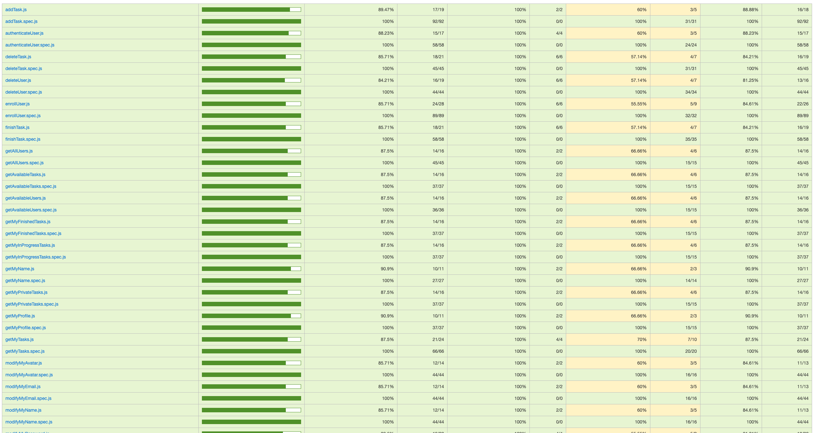
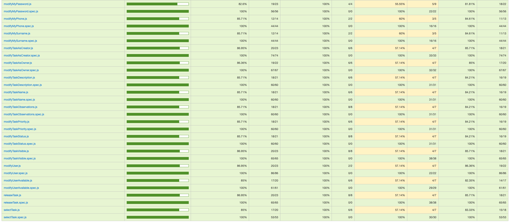

# DailyWork App

## Application to manage the diferent tasks of a company and the management of its employees

## Functional

### Use Cases

User | Admin

- Manage tasks
  - Add task
  - Modify task
  - Delete task
  - Assign task
  - Choose Task
- View tasks
  - Available tasks
  - Private tasks
  - Completed tasks
- See all employees and only availables employees
  - Profile avatar
  - Email
  - Name
  - Surname
  - Phone number

Admin

- Enroll employee
- Unsubscribe employee

#### Version 0.1

User | Admin

- Sign in
- Sign out
- Edit profile
- Request vacation
- Request resignation
- Recover password

Admin

- View an employee's tasks
- View an employee's statistics
- Manage vacations
- Manage sick leave
- Create task and assign to user

### UI Design

[Figma prototype for Admin](https://www.figma.com/proto/5uOjSIpnFtSknK8ue2YEVZ/Daily-Work?node-id=10-2014&t=JavRykOG7aO5NesI-1)

[[Figma prototype for User]](https://www.figma.com/proto/5uOjSIpnFtSknK8ue2YEVZ/Daily-Work?node-id=0-1&t=JavRykOG7aO5NesI-1)

## Technical

### Data Model

#### User|Admin

- id (auto)
- name (string, required)
- surname (string, required)
- phone (string, optional)
- avatar (string, optional)
- email (string, unique, required)
- password (string, required, hashed)
- role (string, required, default user, enum: user|admin)
- available (boolean, default true)
- manager (User.id)

#### Task

- id (auto)
- creator (User.id, required)
- owner (User.id, default the creator)
- name (string, required)
- description (string, required)
- status (string, required, default toDo, enum: toDo|inProgress|finished|canceled)
- priority (string, required, default low, enum: low|medium|high)
- visible (boolean, required, default true)
- observations (string, optional)
- completionTime (number, required if state is finished)

## Technologies Used

- Frontend: React, Vite
- Backend: Node.js
- Testing: Mocha Chai

### Code Coverage

